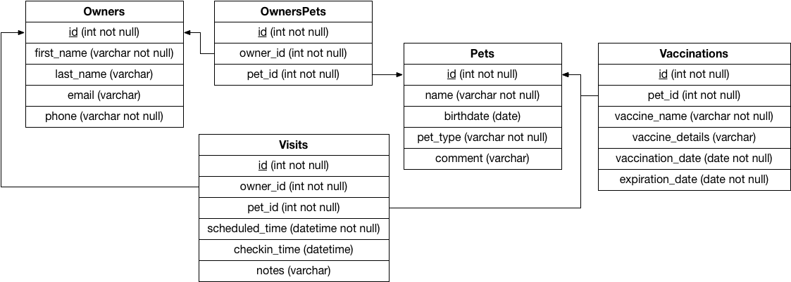

# CS 340 Project Step 4:  CREATE, READ, UPDATE, & DELETE Operations
## Ryan Gomes - gomesr@oregonstate.edu
## Kelley Reynolds - reynokel@oregonstate.edu

# Project URL
http://flip1.engr.oregonstate.edu:8619/

# Content From Reivews

## Step 4 Feedback

**1**

> CREATE functionalities
> Does the INSERT form actually work for entities and relationships, as required in the Specs?
> Owner: Functional
> Pet: Functional
> Visit: Functional
> Owner/Pet: Can't View Results
> Vaccinations: Functional
> Does INSERTing rows in the "M entity" of the 1-to-M relationship rows affect the INSERTing of rows in the "1 entity"?
> No way to view all the "Manys" effect on the "One". Ex. Can't see all the vacinations for a single pet.
> Does INSERTing rows in the "M entity" of the M-to-M relationship rows affect the INSERTing of rows in the other "M entity"?
> No way to view all the many to many relationships. Thus, cannot determine.
> Anything else that you think is important for the CREATE functionalities and could be improved?
> You can probably hide the IDs using CSS since it shouldn't be necessary for input.
> You can use Queries to Select all the Owner's/Pet's/etc. from a table and have that info loaded in a selection on the form instead of having the user enter text.
> READ functionalities
> Are rows being listed for all relationships, as described in the Specs?
> owner: Functional
> pet: Functional
> visit: Functional - should OwnerID/PetID be in Visits?
> owner/Pet: Can't View Results
> vaccinations: Functional
> Is there a better way that data could be displayed on these pages? OR Could the style of the webpage be improved?
> on't show IDs, display names instead.
> Anything else that you think is important for READ functionalities and could be improved?
> or the sake of looking at data, it would be helpful to
> UPDATE functionalities
> Is the UPDATE functionality properly implemented for at least one entity?
> Visit: Functional
> What is the effect of this UPDATE on the relationships that the entity is participating in ?
> Owner and Pet now have another visit
> What is the effect of CREATE and DELETE operations on the other entities that are participating in the relationship with this entity?
> Deleting an owner also deletes a visit.
> Anything else that you think is important for the UPDATE functionality?
> Instead of using Visit IDs, use a SEELCT query to populate a selection menu
> DELETE functionalities
> Does DELETE work as required by the Project Guide AND as defined by the Project Outline?
> Yes
> My Comments:
> I think it's cool you're using Flask.
> Don't let the user input IDs, you can avoid this by using a SELECT query to populate with radio buttons/select menus/etc.
> It would be helpful if you grouped the links by function or type, like group all the add links together or all the pet links together.
> To easily view relationships and their effects, having the option to view all the data would be helpful.

**2**
> Does the INSERT form actually work for entities and relationships, as required in the Specs?
> Yes, I added a"test guy" succesfully
> Does INSERTing rows in the "M entity" of the 1-to-M relationship rows affect the INSERTing of rows in the "1 entity"?
> Not that I can see
> Does INSERTing rows in the "M entity" of the M-to-M relationship rows affect the INSERTing of rows in the other "M entity"?
> No, not that I can see
> Anything else that you think is important for the CREATE functionalities and could be improved?
> The site was simple and straight forward. Links for adding entities were clearly present.
> Is the UPDATE functionality properly implemented for at least one entity?
> I'm not sure. I was able to update a customer number that didnt exist. I was brought to the
> "succes" message, but im not sure what happened in the db
> What is the effect of this UPDATE on the relationships that the entity is participating in ?
> I did not see any update effects. just a success messageWhat is the effect of CREATE and DELETE operations on the other entities that are participating in the relationship with this entity?
> They seem to work fine. I was able to add the test owner. delete takes me to the success message again
> Anything else that you think is important for the UPDATE functionality?
> It would be nice to see the table before updating
> Does DELETE work as required by the Project Guide AND as defined by the Project Outline?
> Yes, I believe so. I cant be sure, because the tables are not visible.

**3**
> Does the INSERT form actually work for entities and relationships, as required in the Specs?
> Yes, you can add owner, pet, visit, owner of a pet relationship, vaccination record, all the adds look good and I could see that they were correctly added since the add pages also function as “view” for those tables.
> Does INSERTing rows in the "M entity" of the 1-to-M relationship rows affect the INSERTing of rows in the "1 entity"?
> I don’t think so but I’m not sure, I had a hard time figuring out how to view everything so I could determine this.
> Does INSERTing rows in the "M entity" of the M-to-M relationship rows affect the INSERTing of rows in the other "M entity"?
> Same as above, I don’t think so but I’m not sure, as I had a hard time figuring out how to view everything so I could determine this.
> Anything else that you think is important for the CREATE functionalities and could be improved?
> It seems the only way to view tables is to add something to them or search them, but I wanted to be able to just view say, all of the pets and all of the owners and all of the foreign keys, etc without having to go to an add page.
> READ functionalities
> Are rows being listed for all relationships, as described in the Specs?
> The read funcitonality on the add pages seems to work, but some of the search parts don’t work like lookup an onwer record, lookup the record ffor a pet by name, find all pets for an owner, find all owners for a pet, but it looks like the developers are already aware of this based on their website showing in green which things they thought were functional at this time. so once they get the search implemented I think they’ll have met all the requirements.
> Is there a better way that data could be displayed on these pages? OR Could the style of the webpage be improved?
> although they do have read functionality and search functionality that will be implemented soon, it’s still not possible to view an entire table that’s not searched or filtered unless the user goes to an “add” page. maybe it makes sense for a real website where you don’t want users to be able to view everything but in this class for being able to evaluate the project I thought it’d be helpful to be able to see everything easier.
> Anything else that you think is important for READ functionalities and could be improved?
> No I think just the comment above.
> UPDATE functionalities
> Is the UPDATE functionality properly implemented for at least one entity?
> Yes, it’s working for update a visit record w checkin time, and update notes for a visit.
> What is the effect of this UPDATE on the relationships that the entity is participating in ?
> It changes the checkin time for a visit, and updates the notes for a visit. but this was hard to see without knowing to go back one page (I figured that out).
> What is the effect of CREATE and DELETE operations on the other entities that are participating in the relationship with this entity?
> If you delete a record for a visit, it says it’s deleted, but I couldn’t figure out how to get back to the view visits page to see how that affected the “update a visit with notes” page, I assume it’d delete the visit so any updated notes would also be deleted, but as with this project generally, it was good just hard to tell what was going on because it was so hard to figure out how to view all the tables like where to go.
> add a visit just adds a new visit it doesn’t affect the updated visit
> Anything else that you think is important for the UPDATE functionality?
> no I think that’s about it
> DELETE functionalities
> Does DELETE work as required by the Project Guide AND as defined by the Project Outline?
> only for delete the record of an owner, they still need to fix unlink owner from a pet and delete a record for a visit.
> (I leave it to your judgment to determine what other things are important to review for DELETE functionalities.)
> for delete the record of an owner it appeared to work, but again I had to figure out that I had to go back one page after submitting when given the option to be able to view the table now that that entity had been deleted. I felt this should have been automatically updated (maybe w ajax or something?) so I could have seen the updated information without having to figure out I had to click the go back one page button to view the table now that the owner record had been deleted. it was just kind of confusing to be able to find what the table looked like after each operation.

**4**

> CREATE functionalities
> Does the INSERT form actually work for entities and relationships, as required in the Specs? Yes, the Insert seems to work for each entity.
> Does INSERTing rows in the "M entity" of the 1-to-M relationship rows affect the INSERTing of rows in the "1 entity"? I'm not able to see the data in a table or anything to see how it's affected
> Does INSERTing rows in the "M entity" of the M-to-M relationship rows affect the INSERTing of rows in the other "M entity"? I'm not able to see the data in a table or anything to see how it's affected
> Anything else that you think is important for the CREATE functionalities and could be improved? Maybe adding some dropdowns to keep the data consistent. For example, Pet Type would be a great candidate for that.
> READ functionalities
> Are rows being listed for all relationships, as described in the Specs? Some show the results and some don't. For example, owner/pet relationship doesn't display any existing data.
> Is there a better way that data could be displayed on these pages? OR Could the style of the webpage be improved? Yes, display the data in a table and have the CRUD functions related to that entity in that specific page versus having all of them in one page. The current layout is not very intuitive.
> Anything else that you think is important for READ functionalities and could be improved? Just as noted above, have specific pages for each entity.
> UPDATE functionalities
> Is the UPDATE functionality properly implemented for at least one entity? yes, updated a visit with notes
> What is the effect of this UPDATE on the relationships that the entity is participating in ?
> What is the effect of CREATE and DELETE operations on the other entities that are participating in the relationship with this entity? Seems to work correctly
> Anything else that you think is important for the UPDATE functionality? Again, anything you can update for a single entity whether it be notes or check in time for a visit, put them in the same page so the user doesn't have to flip back and forth.
> DELETE functionalities
> Does DELETE work as required by the Project Guide AND as defined by the Project Outline? Yes, deleted a record of an owner
> (I leave it to your judgment to determine what other things are important to review for DELETE functionalities.)

### Fixes based on step 4 Feedback
There weren't any surprise changes based on the step 4 feedback. As we'd anticipated, we only continued working to make each component functional and created more of a friendlier interface

## Step 3 Feedback
**1**
> DML:
> Are the queries syntactically correct? Disregard the part where input will be substituted as shown in the sample_data_manipulation_queries.sql
>  Yes, the syntax looks good!
> Are there queries providing all functionalities as required by the CS340 Project Guide ? What query is missing ? What needs to be fixed?
>  Yes, they are all covered.
> Do the queries cover the relationships as required by the CS340 Project Guide?
>  Yes.
> HTML:
> Does each functionality listed in the CS340 Project Guide have a corresponding HTML page? (It's okay to implement multiple functionalities on the same HTML page)
> Yep.
> Is there a better way that data could be displayed on SHOW functionality pages?
>  Hard to tell since it doesn't work yet, but I think it will be fine.
> Is there a better way that the forms for UPDATE and ADD functionalities could be implemented?
>  They are very straightforward!
> Is there a better way that the DELETE functionalities could be implemented?
>   Depends on what "better" means, I think this all fits the requirements, but it's pretty tedious to go back and forth to all of the different pages.
> Is there a way to search OR filter data ? (Remember, it need not work since these are just HTML pages)
>  Yes.
> DDQ:
> Is the SQL file syntactically correct? This can be easily verified by importing/copy-pasting it in phpmyadmin. (Do not forget to take backup of your own database before you do this!)
>   Imported great!  Everything is there.
> Are the data types appropriate considering the description of the attribute in the database outline?
>  Yes.
> Are the foreign keys correctly defined when compared to the Schema?
>  Yep, they're all the same.
> Are relationship tables present when compared to the ERD/Schema?
>  Yes, I see owners_pets in there.
> Great job guys, everything looks solid.

**2**
> An ideal peer review Data Manipulation Queries would answer all of the following questions:
> Are the queries syntactically correct? Disregard the part where input will be substituted as shown in the sample_data_manipulation_queries.sql
> Yes the queries are syntactically correct.
> Are there queries providing all functionalities as required by the CS340 Project Guide ? What query is missing ? What needs to be fixed?
> Yes there are queries for all functionalities as required by the CS340 proj guide.
> Do the queries cover the relationships as required by the CS340 Project Guide?
> Yes.
> An ideal peer review for the HTML Pages would answer all of the following questions.
> Does each functionality listed in the CS340 Project Guide have a corresponding HTML page? (It's okay to implement multiple functionalities on the same HTML page)
> Yes each functionality has its own page.
> Is there a better way that data could be displayed on SHOW functionality pages?
> Once this is functioning, I'm sure it'll look good.
> Is there a better way that the forms for UPDATE and ADD functionalities could be implemented?
> Not in my opinion.
> Is there a better way that the DELETE functionalities could be implemented?
> Again, not in my opinion.
> Is there a way to search OR filter data ? (Remember, it need not work since these are just HTML pages)
> Yes.
> An ideal peer review for a DDQ file would answer all of the following questions:
> Is the SQL file syntactically correct? This can be easily verified by importing/copy-pasting it in phpmyadmin. (Do not forget to take backup of your own database before you do this!)
> Yes, it works.
> Are the data types appropriate considering the description of the attribute in the database outline?
> Yes the data types are appropriate given the attributes described in the database outline.
> Are the foreign keys correctly defined when compared to the Schema?
> Yes they are correctly defined.
> Are relationship tables present when compared to the ERD/Schema?
> Yes! Super good job.

**3**

> DML:
> 1. Are the queries syntactically correct? Disregard the part where input will be substituted as shown in the sample_data_manipulation_queries.sql
> No, I found (insert into owners values (null, :first_name, :last_name, :email, :phone)) show error (No database selected).
> 2. Are there queries providing all functionalities as required by the CS340 Project Guide ? What query is missing ? What needs to be fixed?
> Yes, they provide all functionalities.
> 3. Do the queries cover the relationships as required by the CS340 Project Guide?
> Yes, it covers all the relationships.
> HTML:
> 1. Does each functionality listed in the CS340 Project Guide have a corresponding HTML page? (It's okay to implement multiple functionalities on the same HTML page)
> Yes, each functionality has a corresponding HTML page.
> 2. Is there a better way that data could be displayed on SHOW functionality pages?
> I can't see the actual effect, maybe it's enough.
> 3. Is there a better way that the forms for UPDATE and ADD functionalities could be implemented?
> It may be better to combine these two functionalities together.
> 4. Is there a better way that the DELETE functionalities could be implemented?
> It might be better to make DELETE functionalities to a button.
> 5. Is there a way to search OR filter data ? (Remember, it need not work since these are just HTML pages)
> Yes, it can.
> DDQ:
> 1. Is the SQL file syntactically correct? This can be easily verified by importing/copy-pasting it in phpmyadmin. (Do not forget to take backup of your own database before you do this!)
> Yes, it is correct.
> 2. Are the data types appropriate considering the description of the attribute in the database outline?
> Yes, I think the data types appropriate considering the description of the attribute.
> 3. Are the foreign keys correctly defined when compared to the Schema?
> Yes, the foreign keys are correctly defined.
> 4. Are relationship tables present when compared to the ERD/Schema?
> Yes, it has relationship tables.

**4**
> DMQ
> 1) Are the queries syntactically correct?
> Yes they appear to be correct.
> 2) Are there queries providing all functionalities as required by the CS340 Project Guide?
> Yes the queries handle all required functionalities.
> Do the queries cover the relationships as required by the CS340 Project Guide?
> 3) yes all relationships are covered.
> HTML Pages:
> 1) Does each functionality listed in the CS340 Project Guide have a corresponding HTML page?
> Yes though I guess I was expecting some ability to see certain tables in general, excluding secure data.
> 2) Is there a better way that data could be displayed on SHOW functionality pages?
> I would like to see tables and view fleshed out in general though it looks like they are ahead of the game in meeting many of the add and search features.
> 3) Is there a better way that the forms for UPDATE and ADD functionalities could be implemented?
> I would associate it with the view of the table so that we can see if its added and the general condition of the database.
> 4) Is there a better way that the DELETE functionalities could be implemented?
> Again I would associate it with a table that lets us see the options.
> 5) Is there a way to search OR filter data?
> Assuming the user already has the information of names, ids, etc then the search feature looks good.
> DDQ Files:
> 1) Is the SQL file syntactically correct?
> Yes 2) Are the foreign keys correctly defined when compared to the Schema?
> Yes though I'm interested in whether the user want to keep animals on the roster/existing if owners are gone or the opposite. Both approaches are correct depending on desired outcome.
> 3) Are relationship tables present when compared to the ERD/Schema?
> yes

### Fixes based on Step 3 Feedback
No DDL/modeling changes recommended. We did not receive any feedback from graders on step 3 so made no significant changes. All piazza feedback was also in support of the design we already had so there was nothing else to change for this step.

## Step 2 feedback
**1**

> ERD
> Are the attributes for each entity in the ERD same as that described in the database outline?
> No attributes were put in the ERD.
> Is the participation of entities in the relationships same as that described in the outline?
> Yes
> Is the cardinality of entities in the relationships same as that described in the outline?
> Yes
> Based on the Database outline, could any of the relationships be better off described as an Entity instead?
> No, all entities and relationships are in their proper place.
> Is there something that could be changed/improved in the ER Diagram and/or the overall database design?
> You could possibly make vaccines and pets have a many to many relationship because each type of vaccine can be administered to more than one pet, but then you would have to do something with the date attributes. I think it is good as is though.
> Schema
> Are the relationship tables present where required and correctly defined, when compared with the database outline?
> Yes, but the connected lines make it look like vaccinations and visits are related.
> Are foreign keys present where required and correctly defined, when compared with the database outline?
> Yes.
> Do the entity attributes match those described in the outline?
> Yes.
> Is there something that could be changed/improved in the Schema and/or the overall database design?
> Nothing that hasn't been said already.

**2**

> ERD
> Are the attributes for each entity in the ERD same as that described in the database outline?
> ERD did not include attributes, even the primary keys which were specified.
> Is the participation of entities in the relationships same as that described in the outline?
> Yes.
> Is the cardinality of entities in the relationships same as that described in the outline?
> Yes.
> Based on the Database outline, could any of the relationships be better off described as an Entity instead?
> No.
> Is there something that could be changed/improved in the ER Diagram and/or the overall database design?
> It seems right. I am stretching to think of anything. The notes section of the visit captures most of the extraneous details. Maybe a booster date attribute on the vaccination entity to track when a booster would be necessary (rabies every x years, etc).
> Schema
> Are the relationship tables present where required and correctly defined, when compared with the database outline?
> Yes.
> Are foreign keys present where required and correctly defined, when compared with the database outline?
> Yes.
> Do the entity attributes match those described in the outline?
> Yes.
> Is there something that could be changed/improved in the Schema and/or the overall database design?
> Not really. This is a pretty solid starting block.

**3**

> Are the attributes for each entity in the ERD same as that described in the database outline?
> No, i didn't found attribute in the ERD
> Is the participation of entities in the relationships same as that described in the outline?
> Yes
> Is the cardinality of entities in the relationships same as that described in the outline?
> Yes
> Based on the Database outline, could any of the relationships be better off described as an Entity instead?
> No
> Is there something that could be changed/improved in the ER Diagram and/or the overall database design?
> add attributes
> Schema
> Are the relationship tables present where required and correctly defined, when compared with the database outline?
> Yes
> Are foreign keys present where required and correctly defined, when compared with the database outline?
> Yes
> Do the entity attributes match those described in the outline?
> Yes
> Is there something that could be changed/improved in the Schema and/or the overall database design?

**4**
> Are the attributes for each entity in the ERD same as that described in the database outline? No
> Is the participation of entities in the relationships same as that described in the outline? Yes
> Is the cardinality of entities in the relationships same as that described in the outline? Yes
> Based on the Database outline, could any of the relationships be better off described as an Entity instead? No
> Is there something that could be changed/improved in the E R Diagram and/or the overall database design?  Add some attributes for entity would be better
> Schema
> Are the relationship tables present where required and correctly defined, when compared with the database outline? Yes
> Are foreign keys present where required and correctly defined, when compared with the database outline? Yes
> Do the entity attributes match those described in the outline? Yes
> Is there something that could be changed/improved in the Schema and/or the overall database design? No

### Fixes based on Step 2 Feedback
We didn't have any additional upgrades to make from the draft version. attribute names were included in the ERD along with primary keys.

## Step 1 Feedback
### Fixes based Step 1 Feedback

The feedback for Step 1 was positive, no changes were recommended.
Both of us are experienced with SQL databases so it was not expected that many/any changes would be necessary for the project.

# Project Overview

## Outline and Database Outline

Our project will be a simple veterinary practice management database. As part of the project, we will look to keep track of pets as they make visits to the vet to receive standard vaccinations. Additionally, we will be able to keep track of the owners(s) of the pets and miscellaneous details about the visits made. This project will attempt to follow a standard model that should be replicable in similar veterinary practice settings.

## Owners

### Description

Owners will represent people who have pets.

### Attributes

* Id - integer (required)
    * Automatically assigned number serving as the primary key of the table. No business meaning
* First_Name - varchar(25) (required)
    * First name of the owner
* Last_Name - varchar(25)
    * Last name of the owner
* Email - varchar(50)
    * The owner's preferred contact email address.
* Phone - varchar(15) (required)
    * The owner's preferred contact phone.

### Relationships

An owner will have a many to many relationship with pets.
A pet is not required.
An owner will have a one to many relationship with visits.
A visit is not required.

## Pets

### Description

Pets will represent the animals visiting the veterinary clinic.
The Pet Type will indicate the animal species.
The Comment column will have arbitrary additional notes about the description or living conditions of the animal.

### Attributes

* Id - integer (required)
    * Automatically assigned number serving as the primary key of the table. No business meaning
* Name - varchar(25) (required)
    * Preferred name of the pet
* Birthdate - date
    * Date of birth of the pet. Null if unknown.
* Pet_Type - varchar(25) (required)
    * Friendly description of the breed (dog, cat, fish, etc...)
* Comment - varchar(256)
    * Additional details about the pet

### Relationships

A Pet will have a many to many relationship with an owner.
An owner is required.
A Pet will have a one to many relationship with vaccinations.
A vaccination is not required.
A Pet will have a one to many relationship with a visit.
A visit is not required.

## Visit

### Description

A visit will encapsulate a consultation involving a single pet and an owner.
If more than one owner is present at a visit, a single owner will be chosen and used.
If more than one pet is brought at a time with a single owner, it will be recorded independently as a visit for each pet.
The notes are arbitrary text encapsulating the details/reasons/results of the visit.

### Attributes

* Id - integer (required)
    * Automatically assigned number serving as the primary key of the table. No business meaning
* checkin_time - datetime
    * Timestamp of when the visit was checked in to by the owner/pet
* scheduled_time - datetime (required)
    * Timestamp when the visit was scheduled.
* Owner_ID - int (required)
    * Foreign key to the owner associated with the visit.
* Pet_ID - int (required)
    * Foreign key to the pet associated with the visit.
* Notes - varchar(256)
    * Additional details of the visit.

### Relationships

A visit has many to one relationship with an owner, an owner is required.
A visit has many to one relationship with a pet, an pet is required.

## Vaccination

### Description

A vaccination records the details of a pet's vaccination.
The vaccination date records the date of vaccine administration and the expiration date records the date at which the vaccine is no longer effective.

### Attributes

* Id - integer (required)
    * Automatically assigned number serving as the primary key of the table. No business meaning
* Pet ID - int (required)
    * Foreign key to the pet associated with the vaccination.
* Vaccine_Name - varchar(25) (required)
    * Name of the the vaccination.
* Vaccine_Details - varchar(256)
    * Description of the the vaccination.
* Vaccination_Date - date (required)
    * Date the vaccination was administered.
* Expiration_Date - date (required)
    * Date the vaccination expires.

# Entity Relationship Diagram

# Schema

