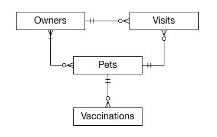
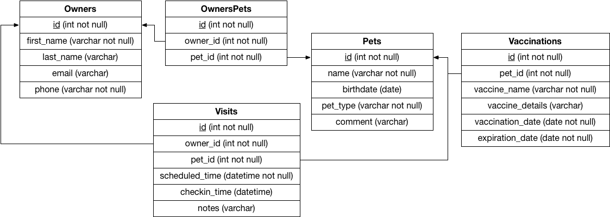

# CS 340 Project Step 2: ERD & Schema
## Ryan Gomes - gomesr@oregonstate.edu
## Kelley Reynolds - reynokel@oregonstate.edu

# Feedback From Peer Reviewer
**Gaetan I**
**ERD**
* Are the attributes for each entity in the ERD same as that described in the database outline?
    * No attributes were put in the ERD.
* Is the participation of entities in the relationships same as that described in the outline?
    * Yes
* Is the cardinality of entities in the relationships same as that described in the outline?
    * Yes

* Based on the Database outline, could any of the relationships be better off described as an Entity instead?
    * No, all entities and relationships are in their proper place.

* Is there something that could be changed/improved in the ER Diagram and/or the overall database design?
    * You could possibly make vaccines and pets have a many to many relationship because each type of vaccine can be administered to more than one pet, but then you would have to do something with the date attributes. I think it is good as is though.

**Schema**

* Are the relationship tables present where required and correctly defined, when compared with the database outline?
    * Yes, but the connected lines make it look like vaccinations and visits are related.

* Are foreign keys present where required and correctly defined, when compared with the database outline?
    * Yes.

* Do the entity attributes match those described in the outline?
    * Yes.

* Is there something that could be changed/improved in the Schema and/or the overall database design?
    * Nothing that hasn't been said already.

**Randolph Tucker**

**ERD**

* Are the attributes for each entity in the ERD same as that described in the database outline?
    * ERD did not include attributes, even the primary keys which were specified.

* Is the participation of entities in the relationships same as that described in the outline?
    * Yes.

* Is the cardinality of entities in the relationships same as that described in the outline?
    * Yes.

* Based on the Database outline, could any of the relationships be better off described as an Entity instead?
    * No.

* Is there something that could be changed/improved in the ER Diagram and/or the overall database design?
    * It seems right. I am stretching to think of anything. The notes section of the visit captures most of the extraneous details. Maybe a booster date attribute on the vaccination entity to track when a booster would be necessary (rabies every x years, etc).

**Schema**
* Are the relationship tables present where required and correctly defined, when compared with the database outline?
    * Yes.

* Are foreign keys present where required and correctly defined, when compared with the database outline?
    * Yes.

* Do the entity attributes match those described in the outline?
    * Yes.

* Is there something that could be changed/improved in the Schema and/or the overall database design?
    * Not really. This is a pretty solid starting block.

**Zhongkai Huang**

**ERD**
* Are the attributes for each entity in the ERD same as that described in the database outline?
    * No, i didn't found attribute in the ERD

* Is the participation of entities in the relationships same as that described in the outline?
    * Yes

* Is the cardinality of entities in the relationships same as that described in the outline?
    * Yes

* Based on the Database outline, could any of the relationships be better off described as an Entity instead?
    * No

* Is there something that could be changed/improved in the ER Diagram and/or the overall database design?
    * add attributes

**Schema**
* Are the relationship tables present where required and correctly defined, when compared with the database outline?
    * Yes

* Are foreign keys present where required and correctly defined, when compared with the database outline?
    * Yes

* Do the entity attributes match those described in the outline?
    * Yes

* Is there something that could be changed/improved in the Schema and/or the overall database design?
    * No

**Haofeng Tian**
**ERD**
* Are the attributes for each entity in the ERD same as that described in the database outline?
    * No

* Is the participation of entities in the relationships same as that described in the outline?  
    * Yes

* Is the cardinality of entities in the relationships same as that described in the outline?
    * Yes

* Based on the Database outline, could any of the relationships be better off described as an Entity instead?
    * No

* Is there something that could be changed/improved in the E R Diagram and/or the overall database design?  
    * Add some attributes for entity would be better

**Schema**

* Are the relationship tables present where required and correctly defined, when compared with the database outline?
    * Yes

* Are foreign keys present where required and correctly defined, when compared with the database outline?
    * Yes

* Do the entity attributes match those described in the outline?
    * Yes

* Is there something that could be changed/improved in the Schema and/or the overall database design?
    * No

# Actions based on the feedback
We included the attribute names on the ERD including the primary keys

# Upgrades to the Draft version
We didn't have any additional upgrades to make from the draft version

# A. Fixes based on Feedback from Step 1

The feedback for Step 1 was positive, no changes were recommended.
Both of us are experienced with SQL databases so it was not expected that many/any changes would be necessary for the project.

# B. Project Outline and Database Outline - Updated Version

Our project will be a simple veterinary practice management database. As part of the project, we will look to keep track of pets as they make visits to the vet to receive standard vaccinations. Additionally, we will be able to keep track of the owners(s) of the pets and miscellaneous details about the visits made. This project will attempt to follow a standard model that should be replicable in similar veterinary practice settings.

## Owners

### Description

Owners will represent people who have pets.

### Attributes

* Id - integer (required)
    * Automatically assigned number serving as the primary key of the table. No business meaning
* First_Name - varchar(25) (required)
    * First name of the owner
* Last_Name - varchar(25)
    * Last name of the owner
* Email - varchar(50)
    * The owner's preferred contact email address.
* Phone - varchar(15) (required)
    * The owner's preferred contact phone.

### Relationships

An owner will have a many to many relationship with pets.
A pet is not required.
An owner will have a one to many relationship with visits.
A visit is not required.

## Pets

### Description

Pets will represent the animals visiting the veterinary clinic.
The Pet Type will indicate the animal species.
The Comment column will have arbitrary additional notes about the description or living conditions of the animal.

### Attributes

* Id - integer (required)
    * Automatically assigned number serving as the primary key of the table. No business meaning
* Name - varchar(25) (required)
    * Preferred name of the pet
* Birthdate - date
    * Date of birth of the pet. Null if unknown.
* Pet_Type - varchar(25) (required)
    * Friendly description of the breed (dog, cat, fish, etc...)
* Comment - varchar(256)
    * Additional details about the pet

### Relationships

A Pet will have a many to many relationship with an owner.
An owner is required.
A Pet will have a one to many relationship with vaccinations.
A vaccination is not required.
A Pet will have a one to many relationship with a visit.
A visit is not required.

## Visit

### Description

A visit will encapsulate a consultation involving a single pet and an owner.
If more than one owner is present at a visit, a single owner will be chosen and used.
If more than one pet is brought at a time with a single owner, it will be recorded independently as a visit for each pet.
The notes are arbitrary text encapsulating the details/reasons/results of the visit.

### Attributes

* Id - integer (required)
    * Automatically assigned number serving as the primary key of the table. No business meaning
* checkin_time - datetime
    * Timestamp of when the visit was checked in to by the owner/pet
* scheduled_time - datetime (required)
    * Timestamp when the visit was scheduled.
* Owner_ID - int (required)
    * Foreign key to the owner associated with the visit.
* Pet_ID - int (required)
    * Foreign key to the pet associated with the visit.
* Notes - varchar(256)
    * Additional details of the visit.

### Relationships

A visit has many to one relationship with an owner, an owner is required.
A visit has many to one relationship with a pet, an pet is required.

## Vaccination

### Description

A vaccination records the details of a pet's vaccination.
The vaccination date records the date of vaccine administration and the expiration date records the date at which the vaccine is no longer effective.

### Attributes

* Id - integer (required)
    * Automatically assigned number serving as the primary key of the table. No business meaning
* Pet ID - int (required)
    * Foreign key to the pet associated with the vaccination.
* Vaccine_Name - varchar(25) (required)
    * Name of the the vaccination.
* Vaccine_Details - varchar(256)
    * Description of the the vaccination.
* Vaccination_Date - date (required)
    * Date the vaccination was administered.
* Expiration_Date - date (required)
    * Date the vaccination expires.

# C. Entity Relationship Diagram

# D. Schema

