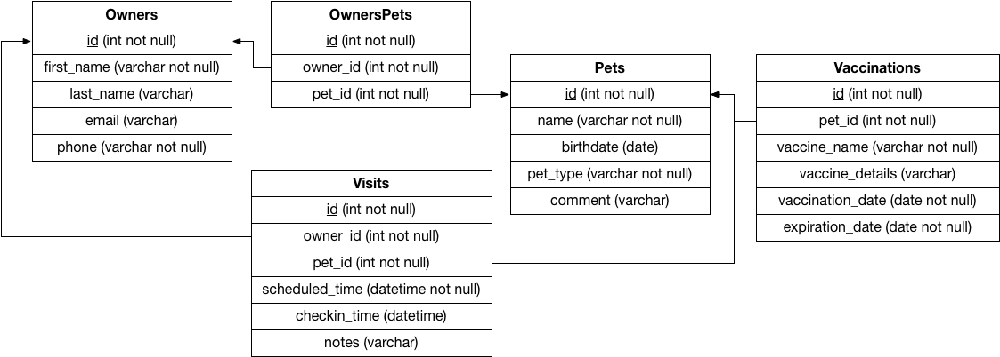

# CS 340 Project Step 3:  Create HTML pages & DML + DDL files
## Ryan Gomes - gomesr@oregonstate.edu
## Kelley Reynolds - reynokel@oregonstate.edu

# Step 3 URL
http://flip1.engr.oregonstate.edu:8619/

# Content from Step 2 giving Database overview

## A. Fixes based on Step 2 Feedback
We didn't have any additional upgrades to make from the draft version. attribute names were included in the ERD along with primary keys.

## A. Fixes based Step 1 Feedback

The feedback for Step 1 was positive, no changes were recommended.
Both of us are experienced with SQL databases so it was not expected that many/any changes would be necessary for the project.

## B. Project Outline and Database Outline - Updated Version

Our project will be a simple veterinary practice management database. As part of the project, we will look to keep track of pets as they make visits to the vet to receive standard vaccinations. Additionally, we will be able to keep track of the owners(s) of the pets and miscellaneous details about the visits made. This project will attempt to follow a standard model that should be replicable in similar veterinary practice settings.

## Owners

### Description

Owners will represent people who have pets.

### Attributes

* Id - integer (required)
    * Automatically assigned number serving as the primary key of the table. No business meaning
* First_Name - varchar(25) (required)
    * First name of the owner
* Last_Name - varchar(25)
    * Last name of the owner
* Email - varchar(50)
    * The owner's preferred contact email address.
* Phone - varchar(15) (required)
    * The owner's preferred contact phone.

### Relationships

An owner will have a many to many relationship with pets.
A pet is not required.
An owner will have a one to many relationship with visits.
A visit is not required.

## Pets

### Description

Pets will represent the animals visiting the veterinary clinic.
The Pet Type will indicate the animal species.
The Comment column will have arbitrary additional notes about the description or living conditions of the animal.

### Attributes

* Id - integer (required)
    * Automatically assigned number serving as the primary key of the table. No business meaning
* Name - varchar(25) (required)
    * Preferred name of the pet
* Birthdate - date
    * Date of birth of the pet. Null if unknown.
* Pet_Type - varchar(25) (required)
    * Friendly description of the breed (dog, cat, fish, etc...)
* Comment - varchar(256)
    * Additional details about the pet

### Relationships

A Pet will have a many to many relationship with an owner.
An owner is required.
A Pet will have a one to many relationship with vaccinations.
A vaccination is not required.
A Pet will have a one to many relationship with a visit.
A visit is not required.

## Visit

### Description

A visit will encapsulate a consultation involving a single pet and an owner.
If more than one owner is present at a visit, a single owner will be chosen and used.
If more than one pet is brought at a time with a single owner, it will be recorded independently as a visit for each pet.
The notes are arbitrary text encapsulating the details/reasons/results of the visit.

### Attributes

* Id - integer (required)
    * Automatically assigned number serving as the primary key of the table. No business meaning
* checkin_time - datetime
    * Timestamp of when the visit was checked in to by the owner/pet
* scheduled_time - datetime (required)
    * Timestamp when the visit was scheduled.
* Owner_ID - int (required)
    * Foreign key to the owner associated with the visit.
* Pet_ID - int (required)
    * Foreign key to the pet associated with the visit.
* Notes - varchar(256)
    * Additional details of the visit.

### Relationships

A visit has many to one relationship with an owner, an owner is required.
A visit has many to one relationship with a pet, an pet is required.

## Vaccination

### Description

A vaccination records the details of a pet's vaccination.
The vaccination date records the date of vaccine administration and the expiration date records the date at which the vaccine is no longer effective.

### Attributes

* Id - integer (required)
    * Automatically assigned number serving as the primary key of the table. No business meaning
* Pet ID - int (required)
    * Foreign key to the pet associated with the vaccination.
* Vaccine_Name - varchar(25) (required)
    * Name of the the vaccination.
* Vaccine_Details - varchar(256)
    * Description of the the vaccination.
* Vaccination_Date - date (required)
    * Date the vaccination was administered.
* Expiration_Date - date (required)
    * Date the vaccination expires.

# C. Entity Relationship Diagram

# D. Schema

